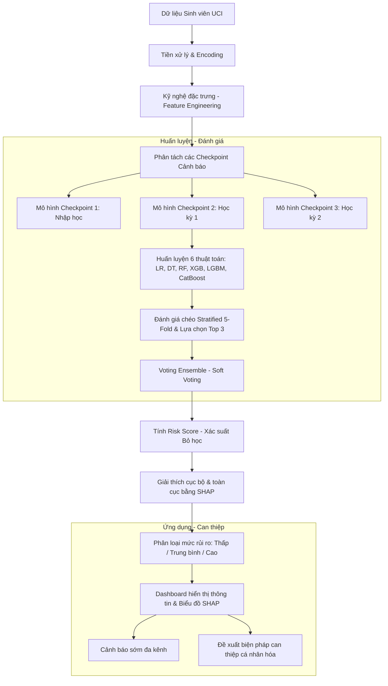
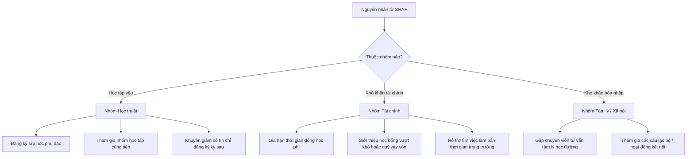

# HỆ THỐNG CẢNH BÁO SỚM SINH VIÊN CÓ NGUY CƠ HỌC TẬP YẾU VÀ BỎ HỌC BẰNG MACHINE LEARNING

## 1. Tổng quan đề tài

Mục tiêu của hệ thống là **phát hiện sớm sinh viên có nguy cơ học tập yếu hoặc bỏ học** (academic failure and dropout) dựa trên các dữ liệu đầu vào có sẵn của nhà trường. Từ đó, cố vấn học tập và phòng đào tạo có thể can thiệp kịp thời trước khi xảy ra các hậu quả không mong muốn.

Đề tài sử dụng bộ dữ liệu chuẩn **"Predict Students Dropout and Academic Success"** từ kho lưu trữ **UCI Machine Learning Repository** để xây dựng và thử nghiệm các mô hình. Hệ thống không chỉ dừng lại ở việc dự báo (Predictive), mà còn giải thích nguyên nhân rủi ro (Explainable AI) và đề xuất các giải pháp can thiệp cá nhân hóa (Prescriptive).

---

## 2. Kiến trúc tổng thể của hệ thống



---

## 3. Giai đoạn 1: Phân tích dữ liệu đầu vào (UCI Dataset)

Bộ dữ liệu `data.csv` bao gồm **4.424 bản ghi** và **36 đặc trưng đầu vào** (features), thuộc 4 nhóm chính:

### 3.1. Các nhóm đặc trưng trong dữ liệu thực tế (`data.csv`)

| Nhóm đặc trưng | Tên biến trong bộ dữ liệu | Mô tả |
| :--- | :--- | :--- |
| **Nhân khẩu học (Demographics)** | `Marital status`, `Nationality`, `Gender`, `Age at enrollment`, `Displaced`, `International` | Giới tính, tuổi nhập học, tình trạng hôn nhân, diện sinh viên xa nhà, sinh viên quốc tế. |
| **Kinh tế - Xã hội (Socio-economic)** | `Mother's qualification`, `Father's qualification`, `Mother's occupation`, `Father's occupation`, `Debtor`, `Tuition fees up to date`, `Scholarship holder`, `Unemployment rate`, `Inflation rate`, `GDP` | Trình độ/nghề nghiệp cha mẹ, tình trạng nợ học phí, việc đóng học phí đúng hạn, học bổng, các chỉ số kinh tế vĩ mô quốc gia. |
| **Học tập lúc nhập học (Admission)** | `Application mode`, `Application order`, `Course`, `Daytime/evening attendance`, `Previous qualification`, `Previous qualification (grade)`, `Admission grade`, `Educational special needs` | Ngành học, hình thức xét tuyển, điểm xét tuyển đầu vào, nhu cầu giáo dục đặc biệt. |
| **Kết quả học tập (Academic - Sem 1 & 2)** | `Curricular units 1st/2nd sem (credited, enrolled, evaluations, approved, grade, without evaluations)` | Số tín chỉ đăng ký/hoàn thành, số lượng bài kiểm tra, điểm trung bình học kỳ 1 và học kỳ 2. |

### 3.2. Phân bố biến mục tiêu (Target Distribution)
Biến `Target` trong dữ liệu thực tế gồm 3 nhóm:
* **Graduate (Tốt nghiệp)**: 2.209 sinh viên (~50%)
* **Dropout (Bỏ học)**: 1.421 sinh viên (~32%)
* **Enrolled (Đang học)**: 794 sinh viên (~18%)

> [!NOTE]
> Để xây dựng hệ thống cảnh báo sớm, ta có hai hướng tiếp cận:
> 1. **Phân loại nhị phân**: Loại bỏ nhóm `Enrolled`, tập trung phân loại `Dropout` (nguy cơ cao) và `Graduate` (an toàn). Đây là phương pháp phổ biến để tối ưu hóa hiệu năng mô hình.
> 2. **Phân loại đa lớp**: Dự đoán cả 3 trạng thái, trong đó nhóm `Enrolled` được giám sát chặt chẽ vì họ là nhóm trung gian có thể chuyển dịch sang `Dropout`.

### 3.3. Chiến lược xây dựng mô hình cảnh báo sớm theo Checkpoint
Để hệ thống có tính ứng dụng thực tế, ta sẽ huấn luyện **3 mô hình độc lập** tương ứng với 3 mốc thời gian (Checkpoint):
1. **Checkpoint 1 (Lúc nhập học)**: Chỉ sử dụng thông tin nhân khẩu, kinh tế - xã hội và điểm tuyển sinh. (Độ chính xác trung bình nhưng cảnh báo sớm nhất).
2. **Checkpoint 2 (Sau học kỳ 1)**: Bổ sung kết quả học tập học kỳ 1. Đây là mốc thời gian vàng để bắt đầu can thiệp học vụ.
3. **Checkpoint 3 (Sau học kỳ 2)**: Sử dụng toàn bộ dữ liệu năm thứ nhất. (Độ chính xác cao nhất).

---

## 4. Giai đoạn 2: Tiền xử lý dữ liệu (Preprocessing)

Mặc dù bộ dữ liệu UCI không có giá trị thiếu (`missing values`), quy trình tiền xử lý vẫn đóng vai trò quyết định đến hiệu năng của các thuật toán:

### 4.1. Mã hóa biến phân loại (Categorical Encoding)
Nhiều biến trong `data.csv` được lưu dưới dạng số nguyên nhưng thực chất là dữ liệu định danh (Nominal), ví dụ: `Course` (ngành học - 171, 9254,...), `Marital status` (1, 2, 3,...). 
* **Giải pháp**: Áp dụng **One-Hot Encoding** cho các biến định danh để các mô hình tuyến tính (như Logistic Regression) không hiểu lầm các con số này có thứ tự lớn nhỏ. Đối với các mô hình cây (LightGBM, CatBoost), có thể khai báo chúng dưới dạng category trực tiếp.

### 4.2. Chuẩn hóa thang đo (Feature Scaling)
Các biến liên tục có thang đo rất khác nhau (ví dụ: `Age at enrollment` từ 17–60, `Admission grade` từ 95–200, GDP từ -4 đến 3.5).
* **Giải pháp**: Áp dụng **StandardScaler** (chuẩn hóa về phân phối chuẩn có $\mu = 0, \sigma = 1$) hoặc **MinMaxScaler** (đưa về khoảng 0–1) cho các đặc trưng số để thuật toán hội tụ nhanh hơn.

### 4.3. Xử lý mất cân bằng lớp (Class Imbalance)
Tỷ lệ `Dropout` chỉ chiếm khoảng 32%, dẫn đến nguy cơ mô hình thiên vị lớp chiếm ưu thế (`Graduate`).
* **Giải pháp**:
  * Sử dụng tham số `class_weight='balanced'` trong các thuật toán.
  * Hoặc áp dụng kỹ thuật lấy mẫu như **SMOTE** (Synthetic Minority Over-sampling Technique) trên tập huấn luyện.
  * Tối ưu ngưỡng quyết định (decision threshold) thay vì sử dụng ngưỡng mặc định $0.5$.

> [!IMPORTANT]
> **Quy tắc phân tách dữ liệu**: Việc chia dữ liệu thành Train / Validation / Test (ví dụ tỷ lệ 70 / 15 / 15 hoặc 80 / 20 có phân tầng `Stratified`) phải được thực hiện **trước khi** tính toán các tham số chuẩn hóa (fit scaler) hoặc thực hiện SMOTE để tránh rò rỉ thông tin dữ liệu (`Data Leakage`).

---

## 5. Giai đoạn 3: Kỹ nghệ đặc trưng (Feature Engineering)

Từ các thuộc tính cơ bản trong `data.csv`, ta thiết lập các đặc trưng mới phản ánh sâu sắc hơn trạng thái học tập của sinh viên:

1. **Tỷ lệ hoàn thành học phần (Curricular Approved Ratio)**:
   $$\text{Approved Ratio (Sem 1)} = \frac{\text{Curricular units 1st sem (approved)}}{\text{Curricular units 1st sem (enrolled)}}$$
   *(Chỉ số này phản ánh năng lực tích lũy tín chỉ. Nếu tỷ lệ này $< 0.5$, sinh viên có nguy cơ trễ hạn tốt nghiệp cực cao).*

2. **Mức độ tích cực thi cử (Evaluation Rate)**:
   $$\text{Evaluation Rate (Sem 1)} = \frac{\text{Curricular units 1st sem (evaluations)}}{\text{Curricular units 1st sem (enrolled)}}$$
   *(Nếu sinh viên đăng ký nhiều môn nhưng số lượt thi/đánh giá lại rất ít, điều này cho thấy sinh viên có dấu hiệu bỏ bê học tập hoặc bỏ thi).*

3. **Xu hướng tiến bộ điểm số (Academic Trend)**:
   $$\text{Grade Trend} = \text{Curricular units 2nd sem (grade)} - \text{Curricular units 1st sem (grade)}$$
   *(Hiệu số âm thể hiện kết quả học tập đang đi xuống, cần lưu ý đặc biệt).*

4. **Chỉ số rủi ro tài chính (Financial Risk Indicator)**:
   Tạo biến nhị phân đại diện cho rủi ro tài chính cao:
   $$\text{Financial Risk} = 1 \quad \text{nếu} \quad (\text{Debtor} == 1 \ \text{HOẶC} \ \text{Tuition fees up to date} == 0)$$

5. **Chỉ số hỗ trợ từ gia đình (Parental Education Score)**:
   Kết hợp trình độ học vấn của bố và mẹ để tính điểm số hỗ trợ học thuật từ gia đình (cha mẹ có học vị cao thường có khả năng định hướng tốt hơn cho con cái).

---

## 6. Giai đoạn 4: Huấn luyện và Đánh giá 6 mô hình

Hệ thống tiến hành huấn luyện đồng thời 6 thuật toán để so sánh hiệu năng:

1. **Logistic Regression**: Làm mô hình cơ sở (Baseline).
2. **Decision Tree**: Dễ giải thích nhưng dễ bị quá khớp (Overfitting).
3. **Random Forest**: Thuật toán Ensemble dạng Bagging ổn định, giảm thiểu lỗi của Decision Tree.
4. **XGBoost**: Thuật toán Boosting mạnh mẽ, tối ưu hóa hàm mục tiêu tốt.
5. **LightGBM**: Tốc độ huấn luyện nhanh, xử lý tốt các biến categorical pre-encoded.
6. **CatBoost**: Tối ưu đặc biệt cho các biến categorical mà không cần mã hóa phức tạp trước đó.

---

## 7. Giai đoạn 5: Đánh giá mô hình và lựa chọn Top 3

Việc đánh giá được thực hiện thông qua kiểm định chéo phân tầng (**Stratified 5-Fold Cross-Validation**) trên tập huấn luyện để đảm bảo tính khách quan.

### 7.1. Các chỉ số đo lường hiệu năng

* **Accuracy (Độ chính xác tổng thể)**: Tỷ lệ dự đoán đúng trên toàn bộ tập dữ liệu.
* **Precision (Độ chính xác dự báo rủi ro)**: Trong số những sinh viên mô hình cảnh báo "nguy cơ bỏ học", có bao nhiêu người thực sự bỏ học.
* **Recall (Độ phủ/Tỷ lệ bắt sót)**: Trong số những sinh viên thực sự bỏ học, mô hình phát hiện được bao nhiêu người.
* **F1-score**: Trung bình điều hòa giữa Precision và Recall.
* **PR-AUC (Area Under Precision-Recall Curve)**: Chỉ số quan trọng nhất khi đánh giá dữ liệu mất cân bằng lớp.

### 7.2. Phân tích bài toán đánh giá rủi ro (Precision-Recall Trade-off)
> [!WARNING]
> Đối với hệ thống cảnh báo sớm sinh viên yếu kém:
> * **Nếu Recall quá thấp**: Hệ thống bỏ sót nhiều sinh viên gặp khó khăn thực sự, khiến họ không nhận được sự hỗ trợ kịp thời và dẫn đến bỏ học (Hậu quả rất nghiêm trọng).
> * **Nếu Precision quá thấp (Cảnh báo sai nhiều)**: Cố vấn học tập sẽ bị quá tải vì phải xử lý quá nhiều trường hợp "báo động giả", dẫn đến tình trạng lờn cảnh báo (Alarm Fatigue).
>
> **Kết luận**: Chỉ số **F1-Score** và **PR-AUC** của lớp `Dropout` sẽ là tiêu chí chính để xếp hạng và lựa chọn Top 3 mô hình tốt nhất để đưa vào bước Ensemble.

---

## 8. Giai đoạn 6: Xây dựng mô hình Ensemble và tính Risk Score

Kết hợp 3 mô hình tốt nhất (ví dụ: **XGBoost**, **LightGBM**, **CatBoost**) bằng cơ chế **Soft Voting Ensemble**.

### 8.1. Công thức tính Risk Score (Điểm số rủi ro)
Risk Score của sinh viên $i$ được tính bằng trung bình có trọng số xác suất dự đoán lớp `Dropout` của các mô hình thành phần:

$$\text{Risk Score}(i) = w_1 \cdot P_{\text{XGB}}(i) + w_2 \cdot P_{\text{LGBM}}(i) + w_3 \cdot P_{\text{Cat}}(i)$$

Trong đó $w_1, w_2, w_3$ là trọng số tương ứng với hiệu năng (ví dụ F1-score) của từng mô hình, thỏa mãn $\sum w = 1$.

*Ví dụ: Sinh viên B có Risk Score = 0.82 (tức là hệ thống dự báo sinh viên này có 82% nguy cơ bỏ học hoặc học tập yếu).*

---

## 9. Giai đoạn 7: Giải thích mô hình bằng Explainable AI (SHAP)

Để vượt qua giới hạn "hộp đen" của Machine Learning, hệ thống sử dụng **SHAP (SHapley Additive exPlanations)** để lượng hóa đóng góp của từng đặc trưng vào kết quả dự đoán của mỗi sinh viên.

```
Risk Score của sinh viên: 82% (Nguy cơ Cao)
=========================================
Đóng góp của các yếu tố (SHAP values):
[+] Curricular units 1st sem (approved) = 0   : +35% (Không qua môn nào ở HK1)
[+] Tuition fees up to date = 0               : +18% (Nợ học phí chưa đóng)
[+] Debtor = 1                                : +12% (Đang có khoản nợ nhà trường)
[+] Age at enrollment = 26                    : +5%  (Nhập học khi lớn tuổi)
[-] Scholarship holder = 0                    : +4%  (Không có học bổng hỗ trợ)
[-] Khác                                      : +8%
```

Nhờ SHAP, cố vấn học tập có thể thấy rõ: Sinh viên này có nguy cơ cao chủ yếu do **năng lực học tập học kỳ 1 quá yếu (không qua môn)** kết hợp với **khó khăn tài chính (nợ học phí)**.

---

## 10. Giai đoạn 8: Phân loại mức độ rủi ro

Dựa trên Risk Score, hệ thống phân chia sinh viên thành các nhóm để quản lý:

| Risk Score | Mức độ rủi ro | Trạng thái hiển thị | Tần suất giám sát |
| :--- | :--- | :--- | :--- |
| **$< 30\%$** | **Thấp (Low)** | Xanh lá (An toàn) | Định kỳ cuối học kỳ |
| **$30\% - 70\%$** | **Trung bình (Medium)** | Vàng (Cần lưu ý) | Hàng tháng |
| **$> 70\%$** | **Cao (High)** | Đỏ (Nguy hiểm) | Hàng tuần / Can thiệp ngay |

---

## 11. Giai đoạn 9: Thiết kế Dashboard Quản trị

Giao diện Web trực quan hóa dữ liệu hỗ trợ các vai trò khác nhau trong nhà trường:

### 11.1. Các chức năng chính
* **Bộ lọc thông minh**: Lọc sinh viên theo ngành học (`Course`), khóa học, mức độ rủi ro (Cao/Trung bình/Thấp).
* **Trang cá nhân sinh viên (Student Profile)**: 
  * Hiển thị thông tin cá nhân và kết quả học tập chi tiết.
  * Biểu đồ **SHAP Force Plot** hoặc **Waterfall Plot** giải thích lý do cụ thể vì sao sinh viên bị cảnh báo.
* **Bảng điều khiển của Cố vấn học tập (Advisor View)**: Danh sách sinh viên phụ trách sắp xếp theo thứ tự giảm dần của Risk Score.

---

## 12. Giai đoạn 10: Cơ chế cảnh báo sớm

Khi Risk Score vượt ngưỡng thiết lập (ví dụ $> 70\%$), hệ thống sẽ tự động kích hoạt quy trình cảnh báo:

* **Hệ thống tin nhắn nội bộ**: Gửi thông báo đến tài khoản Portal của Cố vấn học tập phụ trách lớp học đó.
* **Email tự động**: Gửi email cảnh báo chứa thông tin tổng quan về tình trạng học tập của sinh viên cho cố vấn.
* **Thông báo cho sinh viên**: Gửi lời nhắc nhẹ nhàng trên hệ thống LMS (Moodle) khuyến khích sinh viên liên hệ với cố vấn học tập để nhận hỗ trợ (tránh dùng từ ngữ tiêu cực gây áp lực tâm lý).

---

## 13. Giai đoạn 11: Đề xuất biện pháp can thiệp cá nhân hóa

Hệ thống không chỉ đưa ra cảnh báo, mà còn tự động ánh xạ nguyên nhân dự đoán (SHAP) sang các hành động can thiệp thực tế:



* **Ví dụ thực tế**: Nếu SHAP chỉ ra `Financial Risk` là nguyên nhân lớn nhất, hệ thống sẽ đề xuất giải pháp liên quan đến tài chính (giới thiệu học bổng, gia hạn đóng học phí) thay vì ép buộc sinh viên đi học phụ đạo.

---

## 14. Quy trình vận hành tuần hoàn của hệ thống

```
Dữ liệu lịch sử (UCI) ──> Huấn luyện mô hình ──> Tích hợp hệ thống quản lý trường học
                                                            │
                                                            ▼
Can thiệp thực tế <── Cảnh báo & Đề xuất <── Tính toán Risk Score hàng kỳ/hàng tháng
        │
        ▼
Cải thiện kết quả học tập (Dữ liệu mới) ──> Cập nhật lại mô hình định kỳ (Retraining)
```

---

## 15. Điểm khác biệt và giá trị thực tiễn của đề tài

Thay vì chỉ dừng lại ở một nghiên cứu mang tính lý thuyết dự đoán nhị phân đơn giản, đề tài này giải quyết trọn vẹn chuỗi giá trị dữ liệu thông qua việc trả lời 5 câu hỏi cốt lõi:

1. **Who (Ai)**: Xác định danh sách sinh viên có nguy cơ (dựa trên Risk Score).
2. **When (Khi nào)**: Cảnh báo theo các mốc thời gian (Checkpoint) tăng dần độ chính xác, giúp hành động sớm nhất có thể.
3. **Why (Tại sao)**: Giải thích chi tiết nguyên nhân rủi ro của từng cá nhân bằng SHAP, biến mô hình ML từ "hộp đen" thành công cụ ra quyết định minh bạch.
4. **How much (Mức độ thế nào)**: Phân loại mức độ rủi ro rõ ràng (Thấp / Trung bình / Cao) để tối ưu hóa nguồn lực hỗ trợ của nhà trường.
5. **What to do (Làm gì tiếp theo)**: Đưa ra đề xuất can thiệp cá nhân hóa dựa trên nguyên nhân gây ra rủi ro học tập của sinh viên đó.

---

## 16. Khoảng trống nghiên cứu (Research Gaps) và Sự đóng góp của đề tài

Dựa trên việc đối chiếu với 3 bài báo tổng quan hệ thống (Systematic Literature Review) lớn trong lĩnh vực dự đoán kết quả học tập của sinh viên, đề tài này đã xác định và khỏa lấp các khoảng trống nghiên cứu cụ thể như sau:

### 16.1. Bài báo 1: "A Systematic Literature Review of Student’ Performance Prediction Using Machine Learning Techniques" (MDPI, 2021)
*   **Khoảng trống nghiên cứu xác định:**
    *   **Vấn đề mất cân bằng lớp (Class Imbalance):** Phần lớn các nghiên cứu không xử lý triệt để sự mất cân bằng giữa nhóm sinh viên bỏ học/yếu kém (chiếm số ít) và nhóm tốt nghiệp (chiếm số nhiều), dẫn đến kết quả dự đoán sai lệch trên thực tế.
    *   **Dự báo mang tính tĩnh (Static Prediction):** Thiếu các mô hình dự báo đa giai đoạn (longitudinal/multi-stage). Hầu hết chỉ dự báo kết quả cuối kỳ/cuối khóa khi mọi sự đã rồi, làm mất đi ý nghĩa của khái niệm "cảnh báo sớm".
*   **Sự đóng góp và khắc phục của đề tài:**
    *   Đề tài giải quyết mất cân bằng lớp bằng việc áp dụng **SMOTE** kết hợp điều chỉnh trọng số lớp (`class_weight='balanced'`) và tối ưu hóa ngưỡng quyết định (threshold optimization).
    *   Đo lường hiệu năng bằng **PR-AUC** và **F1-Score** thay vì Accuracy để tránh sai lệch do mất cân bằng dữ liệu.
    *   Thiết lập **chiến lược cảnh báo 3 Checkpoint** giúp dự đoán và cập nhật rủi ro liên tục theo thời gian thực (Lúc nhập học $\to$ Sau học kỳ 1 $\to$ Sau học kỳ 2).

### 16.2. Bài báo 2: "Students' Academic Performance Prediction Using Educational Data Mining and Machine Learning: A Systematic Review" (IJRISS, 2024)
*   **Khoảng trống nghiên cứu xác định:**
    *   **Thiếu tính liên kết chính sách (Disconnect from Educational Policy):** Rất nhiều mô hình đạt độ chính xác cao trên giấy tờ nhưng không thể dịch chuyển thành chính sách giáo dục hay hướng dẫn hành động thực tế cho nhà quản lý.
    *   **Thiếu Kỹ nghệ Đặc trưng đặc thù (Off-the-shelf Algorithms):** Áp dụng trực tiếp thuật toán ML chung chung lên dữ liệu thô mà không thiết kế các đặc trưng phản ánh sâu sắc logic ngành giáo dục.
*   **Sự đóng góp và khắc phục của đề tài:**
    *   Xây dựng hệ thống **quy tắc tự động đề xuất biện pháp can thiệp** cá nhân hóa (Giai đoạn 11), trực tiếp kết nối kết quả kỹ thuật của mô hình với quy trình vận hành thực tế của Phòng Đào tạo và Cố vấn học tập.
    *   Thiết kế các **đặc trưng giáo dục chuyên biệt (Domain-specific features)** như tỷ lệ tích lũy tín chỉ (`Approved Ratio`), mức độ tham gia thi cử (`Evaluation Rate`), và xu hướng tiến bộ học tập (`Academic Trend`) để tối ưu hóa thuật toán cho bối cảnh giáo dục.

### 16.3. Bài báo 3: "Predicting student performance: A comprehensive review of machine learning, deep learning, and explainable AI approaches" (Computers and Education: Artificial Intelligence, 2026)
*   **Khoảng trống nghiên cứu xác định:**
    *   **Hộp đen mô hình (Lack of Interpretability):** Các mô hình Boosting hoặc Ensemble có độ chính xác cao nhưng không thể giải thích được lý do tại sao một sinh viên cụ thể bị cảnh báo. Điều này làm giảm sự tin tưởng của giáo viên và sinh viên đối với hệ thống.
*   **Sự đóng góp và khắc phục của đề tài:**
    *   Tích hợp **Explainable AI (XAI)** thông qua thư viện **SHAP**. Hệ thống không chỉ cung cấp Risk Score mà còn hiển thị biểu đồ lực (Force Plot) và biểu đồ thác nước (Waterfall Plot) để giải thích tường tận đóng góp của từng biến số (học thuật, tài chính, gia đình) ở mức độ cá nhân sinh viên trên giao diện Dashboard.